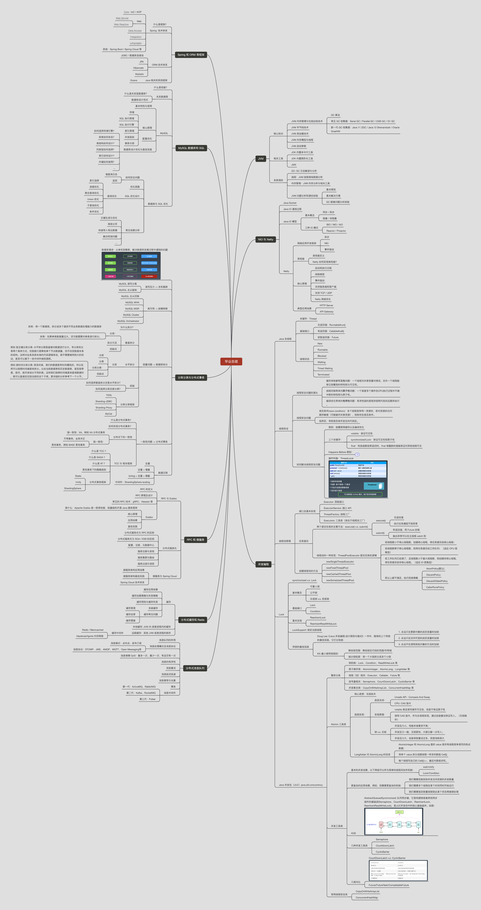

# 毕业总结

## 一. 总结
### JVM

JVM 部分主要讨论了 JVM 的核心知识、相关工具以及如何进行系统调优。

JVM 字节码技术主要讨论了 JVM 字节码的格式，即 Class 文件的格式，以及执行引擎是如何执行定义在 Class 文件中的字节码，让我们进一步理解 Java 代码是如何被 JVM 执行的，有助于我们从底层原理的层面解决问题，例如对于两段实现相同功能的代码，我们可以从字节码层面去理解它们的不同。

JVM 类加载技术主要讨论 JVM 把描述类的数据从Class文件加载到内存，并对数据进行校验、转换解析和初始化，最终形成可以被虚拟机直接使用的 Java 类型的机制，这有助于我们理解 Java 的扩展性和灵活性这些特点，Java天生可以动态扩展的语言特性就是依赖运行期动态加载和动态连接这个特点实现的。例如，编写一个面向接口的应用程序，可以等到运行时再指定其实际的实现类，用户可以通过Java预置的或自定义类加载器，让某个本地的应用程序在运行时从网络或其他地方上加载一个二进制流作为其程序代码的一部分。

JVM 内存管理与垃圾回收技术主要讨论了 JVM 的内存布局、GC 算法 以及不同的 GC 收集器的实现，有助于我们排查问题。

JVM 系统调优主要讨论了 JVM 相关问题的分析和调优经验，以及如何通过不同的工具解决实际的系统调优问题，例如通过 GC 日志、JVM 内存分析工具等进行系统调优。

### NIO 与 Netty

这一部分主要讨论的是 Java IO 、网络编程以及 Nettty。

Java IO 部分主要讨论了不同的 IO 模型，深入分析了 NIO 的相关概念和原理，了解不同技术的应用场景和优缺点。

Netty 部分主要讨论了 Netty 的核心原理、应用场景以及 Netty 选择 NIO 的原因。通过 Netty 实现一个高性能 HTTP/ API网关的案例，进一步分析了如何使用 Netty / NIO 技术进行高性能服务端编程。在此基础上，讨论了常用的压测工具，例如 wrk，压测接口的性能。

### 并发编程

这一部分主要讨论的试试 Java 并发编程的内容。

首先，讨论了 Java 多线程、高并发的相关概念和技术，了解并发编程的核心知识和基本原理；然后，讨论了各种不同的并发工具，例如锁、 Java 并发包、Java 并发容器和工具；接着，讨论了线程安全问题的来源以及如何使用各种并发工具解决线程安全问题。最后，讨论了常见的多线程和并发问题的分析技巧以及排查问题的具体步骤。

### Spring 和 ORM 等框架

这一部分主要介绍 Java  相关的开发框架，包括 Spring 技术体系的框架、ORM 框架等。

这一部分主要讨论的不是具体框架的实现细节，而是从主流的开源框架入手，深入理解框架背后的原理和关系，这是学习框架的内功。在此基础上，讨论如何去做技术选型以及常见框架的一些最佳实践经验，能够根据项目情况进行技术框架的选型。

框架发展很快，是学习不完的，但是原理都是相通的，掌握了原理，就可以更好地去理解技术发展趋势。

### MySQL 数据库和 SQL

这一部分主要讨论的是系统性能优化，而系统的性能与数据库息息相关，因此主要讨论 MySQL 数据库及其优化。

这一部分首先讨论了系统性能是如何度量的，如何找到系统的性能瓶颈，具体方法是什么，通过系统化的学习性能相关知识和实践经验，掌握复杂系统的性能分析方法；然后讨论了 MySQL 的基本使用、核心原理以及最佳实践；在此基础上，讨论了 MySQL 的性能关键点和 MySQL / SQL 优化的一些经验和方法。最后通过一个具体的案例讲解了如何编写高效的、高性能的 SQL，提升 SQL 的性能。

### 分库分表

这一部分主要讨论的是海量数据应该如何处理的问题。

随着数据量的提升，系统逐渐面临越来越大的读写压力、可用性问题、容量问题以及一致性问题。为了解决这些问题，数据库也从单机逐渐发展到了集群，并且引入了各种不同的技术。

为了解决读写压力的问题，引入了MySQL 主从复制架构，进行读写分离；为了解决高可用问题，引入了MySQL 的高可用和高性能架构；为了解决容量问题，引入了分库分表，进行数据库拆分；为了解决一致性问题，引入了分布式事务。

在这些技术的基础上，讨论了不同场景下使用这些技术的最佳实践、分库分表的框架和中间件，并且讨论了应对不同类型数据的处理办法和数据迁移的实现方案和注意事项。

### RPC 和 微服务

这一部分主要讨论的是分布式服务。

这一部分首先讨论了 RPC 的原理、常见的 RPC 技术以及不同技术的应用场景；然后讨论了服务治理相关的一些技术和核心概念；接着讨论了分布式服务化相关的一些技术，例如服务治理、配置管理、注册发现、服务分组、版本管理、集群管理、负载均衡、限流与降级熔断等；最后，讨论了微服务相关的一些核心概念和最佳实践。

在理论的基础上，讨论一些框架。例如 Apache Dubbo 的功能与核心原理，Spring Cloud 技术体系。

### 分布式缓存和 Redis

这一部分主要讨论的是分布式缓存。

这一部分首先讨论了缓存的应用场景、缓存的加载策略和失效策略、缓存与数据库的同步以及缓存常见的问题和解决方案；然后比较了 JVM 内缓存和分布式缓存，讨论了他们的应用场景和实现方式；接着讨论了不同的缓存中间件，并且以 Redis 为例深入介绍了 Redis 的基本使用、核心技术和原理、高级功能以及 Redis 缓存的实现，在此基础上，讨论了Hazelcast 内存网格；最后，深入的讨论了缓存的不同应用场景是如何实现的。

### 分布式消息队列

这一部分主要讨论的是分布式消息队列。

这一部分从 0 开始讨论了消息队列的关键技术和核心知识；接着，以多种不同的消息队列产品为例，讨论了不同产品的实现原理和特性，深入理解消息队列的关键技术是如何展现的；然后以 Kafka 为例，深入讨论了消息队列的应用和实战；最后，动手实现一个简化版的消息队列。

>  消息队列，其实也是一个退化版的数据库。 -- 秦金卫老师

## 二. 知识图谱

