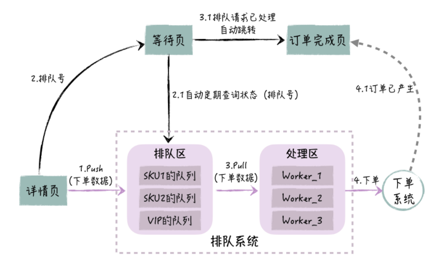

# 如何设计一个秒杀系统？

## 背景和问题

电商类促销活动本质上是一种秒杀活动，一瞬间会有大量的用户流量涌入，流量可以高达平时的几十倍，而且和少量商品的秒杀不同，这些都是有效流量，最终会生成订单。

在正常情况下，系统因为资源有限，只能处理 10% 的流量，无法处理剩下的 90% 流量，瞬间高并发的流量涌入，很大程度上会引起后台系统超时报错，导致用户下单不成功。这样一来，用户就会反复刷新页面，多次尝试下单，不但用户的体验不好，而且系统的压力会更大。

最终的结果就是，系统往往由于过载，整体处理能力下降，甚至瘫痪，导致所有用户都无法购买。

要想解决这个问题，最容易想到的方法就是：加机器。在活动开始前，运营和技术人员会坐在一起，大家一起来预估活动的峰值流量，然后技术人员做评估，系统的哪些节点需要加机器，以及要加多少机器。但这样的做法其实存在几个问题：

* 首先，我们对峰值流量的预估以及要加多少机器都是拍脑袋的，和实际出入往往很大，一旦估计少了，系统同样会面临过载的风险；
* 其次，为了短暂的几分钟促销，我们需要增加大量的机器，事先要做很多的运维准备工作，不但浪费资源，而且效率很低；
* 最为关键的是，有些处理节点，系统不是通过加机器就能扩展处理能力的，比如商品库存数据库，下单时，我们需要扣库存，而为了防止库存更新冲突，我们需要锁定库存记录，导致系统的并发处理能力有限，这个问题单靠加机器是解决不了的。

对于这种高并发情况，看来让系统单纯地通过加机器去硬扛，是不可行的。那么，我们有没有更好的办法，既保证用户体验，又保证系统能够轻松地应对流量挑战呢？

## 总体方案

我们先来深入分析下业务场景。这个秒杀活动的特点是，在短期的 1~2 分钟内，用户流量很大，但只要促销的商品卖完，流量马上恢复常态。所以，对于前端短期内这么大的下单请求，后端如果实时处理，压力会非常大，但如果把这个处理时间延长到 10 分钟，后端是可以完成下单的。那对用户来说，商品优惠的力度这么大，他们关心的是能否买到，所以会愿意多等一段时间，而不是在页面上一次次点击下单，每次系统都提示下单失败。

当然，如果我们把订单处理的时间延长了，只要我们在前台告诉用户，系统已经接受了他们的订单，并且不断同步用户订单处理的进度，用户体验的问题其实也不大。

基于这个分析，我们就可以利用异步处理的思路来应对秒杀活动。

我们先在前端接收用户所有的下单请求，但不在后端实时生成订单，而是放在队列里；然后系统根据后端订单中心的实际处理能力，从队列里获取订单请求，再交给订单中心生成实际的订单。同时，系统告诉用户当前的处理进度，有多少订单排在 TA 的前面，TA 还要等多久。

这样对于用户来说，在前台下单一次就可以了，然后等系统慢慢处理，这也符合先到先得的原则，非常公平合理。对系统来说，只要根据大促的商品总量，一定程度上增强系统处理能力，保证下单请求从进来到最后处理完成，这个时间相对合理就可以了。

比如说，有 20 万件的商品，每人限购一件，预计用户会在 2 分钟内完成下单，但用户能够接受系统在 20 分钟内完成订单处理。这样，系统只要保证每分钟能处理 1 万订单就行；而如果不采取排队的方式，系统就需要每分钟处理 10 万订单，它的压力就会提升一个数量级。

基于排队的思路，系统总体架构设计如下图所示：

在这个架构中，我们在前台和后台下单系统之间，新增了排队系统，它包括排队区和处理区两个部分。系统整体的处理过程是这样的：

* 用户在商品详情页提交订单后，这个订单会作为预订单进入排队区，同时排队系统会返回用户一个排队编号，这个编号用于跟踪后续的订单处理进度；
* 用户被引导到一个等待页，这个页面会根据排队号，定时地查询排队系统，排队系统会返回预订单在队列中的位置信息，包括它前面还有多少未处理的预订单，以及后台系统大概还要多久会处理这个预订单，这样用户就不会焦虑；
* 在排队系统的处理区，有很多消费者，它们依次从排队区的队列里获取预订单，然后调用后台下单系统生成实际的订单；
* 随着预订单变成正式的订单，队列里的预订单会逐渐变少，如果当前的预订单已经从队列里被移除了，用户的等待页就会检测到这个情况，页面自动跳转到订单完成页，这就和常规的购物流程一样了，用户进行最后的支付，最终完成整个前台下单过程。

这里，你可以看到，前台的预订单有瞬时的大流量，但我们只是把它们放到队列里，这个处理起来很快，排队系统可以轻松应对；而后台生成实际的订单是匀速的，并且最大化地发挥了下单系统的处理能力。另一方面，对于用户体验来说，用户可以选择在等待页等候，实时获取订单处理进度的反馈，也可以选择离开，然后在用户中心的“待支付订单”里完成支付。通过这样的设计，排队系统既保证了系统处理订单的能力，也保证了用户良好的体验。